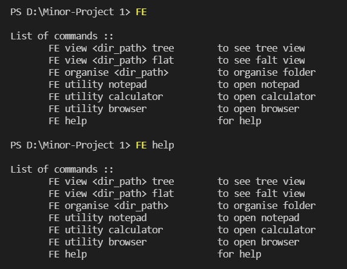
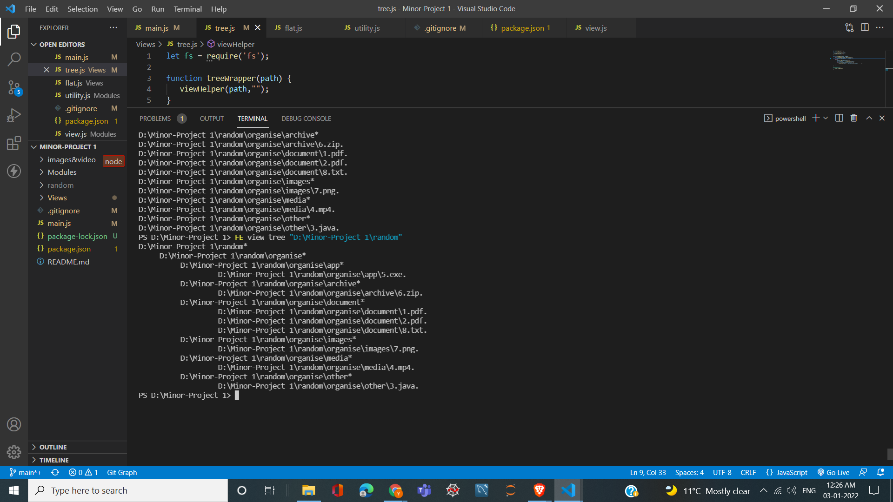
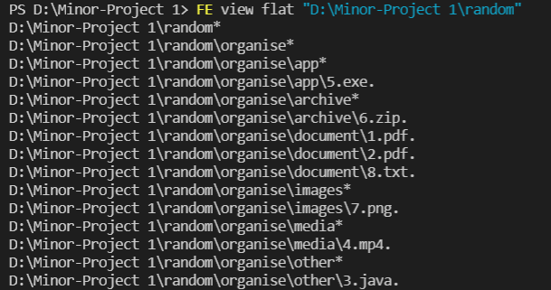
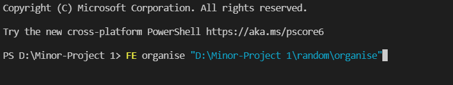
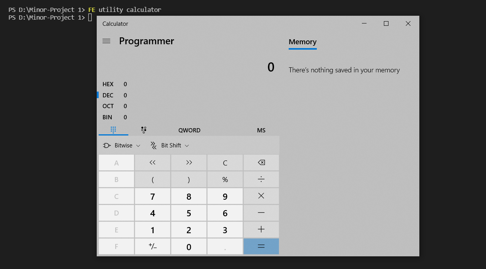

# YG-File-Ease || Node Based CLI

# About The Project

Made with the purpose to keep folders organised. Provides other utility functions to bring the ease to local user. This readme will help to get a better insight.

# Built With

This section list downs the major languaue/frameworks/libraries used:

* [Node.js](https://nextjs.org/)
* [Javascript](https://www.javascript.com/)

# Usage

## 1. Help 

The command can be exceuted with or without help keyword. This is default command to appear

```
List of commands ::
       FE view <dir_path> tree        to see tree view
       FE view <dir_path> flat        to see falt view 
       FE organise <dir_path>         to organise folder
       FE utility notepad             to open notepad
       FE utility calculator          to open calculator
       FE utility browser             to open browser 
       FE help                        for help
```



## 2. View File

The view command comes with two kind of view. Listed below:
```
. Tree View- Gives indented view of the directory
. Flat View- Gives flat view of the directory
```

View command uses * to symbolize directory and . to represent file.<br>
Related images are attached for reference:

#### Tree


#### Flat


## 3. Organise File

This orgaise command helps to filter and sort the files into <b>app</b>, <b>archive</b>, <b>document</b>, <b>media</b>, <b>images</b> and <b>other</b>.
<br>Syntax:



## 4. Open Application

Under this comes several utility functions. As of now there are in total of three functionality support. Listed below:

```
 . FE notepad         FE utility notepad
 . FE calculator      FE utility calculator
 . FE browser         FE utility browser
```

##### Notepad- This opens the notepad via the terminal command


##### Calculator- This opens the programmer's calculator via terminal command


##### Browser- Opens google chrome via termial command


# Contact

Name: Yojan Gandha <br>
Email: [yojangandha1806@gmail.com](yojangandha1806@gmail.com) <br>
Project Link: [YG-CLI-File-Ease](https://github.com/25YojanGandha/YG-CLI-File-Ease) <br>

#### More features will be added in coming time with a visiual UI for better user experience. Until then stay tuned.
